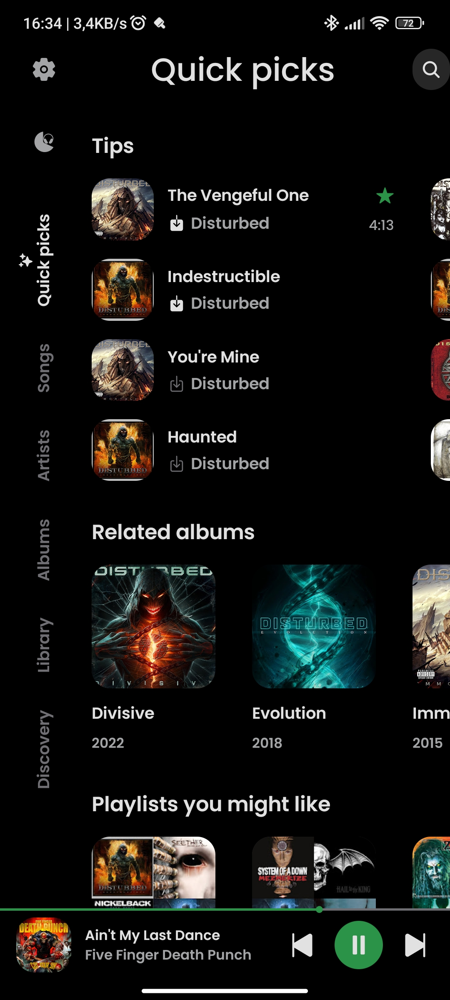
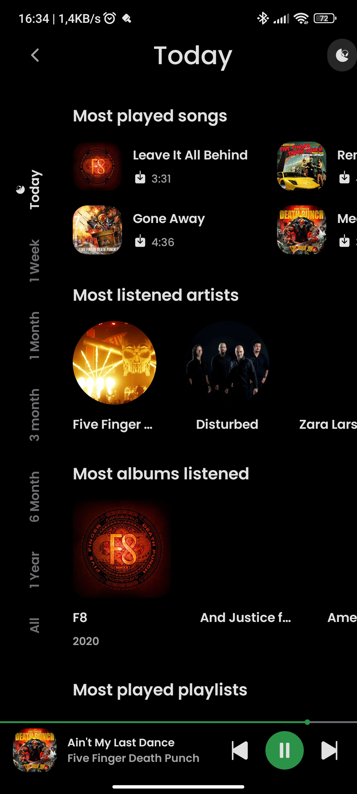
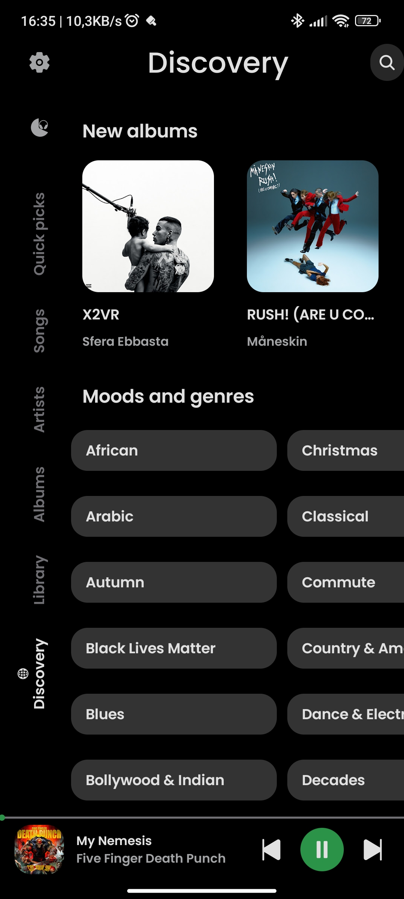
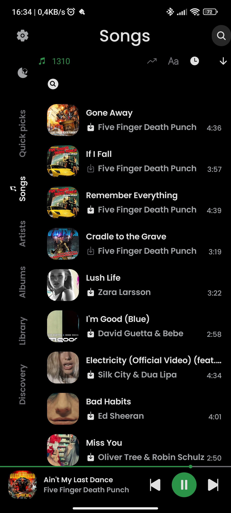
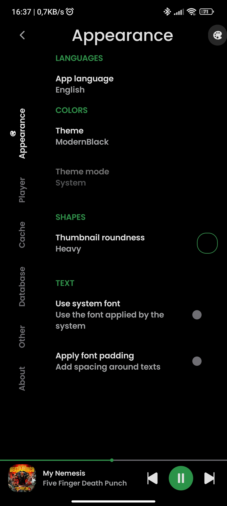

      
  
<b>RiMusic</b> es una aplicación <b>multilingüe</b> para Android para transmitir música desde YouTube Music.

  
Nació como una extensión de la funcionalidad de <b>ViMusic</b>, que conserva la apariencia general y los colores.

## ✨ Características
- **Soporte multilingüe:** Inglés, Italiano, Alemán, Ruso, Francés, Español, Checo, Turco, Rumano y más. Se aceptan contribuciones para otros idiomas.
- Modo de interfaz de usuario, cambia el estilo de RiMusic al estilo clásico de ViMusic y viceversa
- Reproducir canciones desde YouTube Music
- Cambiar tu idioma favorito desde la configuración
- Caching automático de canciones para reproducción sin conexión con tamaño de caché personalizado
- Descargar canciones o listas de reproducción completas para reproducción sin conexión (no caché)
- Reproducción en segundo plano con detención cuando la aplicación se desliza hacia fuera del administrador de tareas
- Optimizaciones del reproductor minimizado
- Estadísticas de escucha
- Visualizador de audio en el reproductor con muchos tipos de efectos. ESTA FUNCIÓN REQUIERE PERMISO DE MICRÓFONO, SOLO SI SE ACTIVA DESDE LA CONFIGURACIÓN. POR DEFECTO ESTÁ DESACTIVADO [Lista completa de permisos](https://github.com/fast4x/RiMusic/wiki/FAQs#-what-permissions-are-used)
- Noticias, estado de ánimo y géneros musicales
- Nuevos álbumes de artistas favoritos
- Buscar canciones, álbumes, artistas y listas de reproducción
- Marcar como favoritos artistas y álbumes
- Importar listas de reproducción en línea
- Gestión de listas de reproducción locales
- Exportar/Importar lista de reproducción local, puede compartir la lista de reproducción de RiMusic con amigos
- Reordenar canciones en la lista de reproducción o cola
- Cola persistente
- Borrar cola
- Soporte de menú Compartir para enlaces de YouTube y YouTube Music
- Obtener, mostrar, editar y traducir letras de canciones sincronizadas o no
- Temas Claro, Oscuro, Dinámico, Negro Puro y Moderno
- Temporizador de sueño con tiempo personalizado
- Normalización de audio
- Omisión de silencios en audio
- Soporte para Android Auto
- Soporte para Android TV
- Buscar actualizaciones, habilitar/deshabilitar desde la configuración

## 📷 Capturas de pantalla

  
  
  
  
  
  

## 🌐 Idiomas disponibles
- **Afrikaans** gracias a [HelloZebra1133](https://crowdin.com/profile/HelloZebra1133)
- **Árabe:** gracias a [ABS zarzis](https://crowdin.com/profile/abszar) y [Ahmad Al Juwaisri](https://crowdin.com/profile/juwaisri)
- **Baskir:** gracias a [Shilave malay](https://crowdin.com/profile/Bash.boy)
- **Catalán:** gracias a [EMC_Translator](https://crowdin.com/profile/EMC_Translator)
- **Chino simplificado:** gracias a [SharkChan0622](https://github.com/SharkChan0622)
- **Chino tradicional:** gracias a [SharkChan0622](https://github.com/SharkChan0622)
- **Checo:** gracias a [ikanakova](https://github.com/ikanakova) y [JZITNIK-github](https://github.com/JZITNIK-github)
- **Danés** gracias a [cultcats](https://crowdin.com/profile/cultcats)
- **Holandés:** gracias a [BabyBenefactor](https://crowdin.com/profile/BabyBenefactor)
- **Inglés:** gracias a [fast4x](https://github.com/fast4x)
- **Esperanto:** gracias a [kjev666](https://github.com/kjev666)
- **Finlandés:** gracias a [rikalaj](https://crowdin.com/profile/rikalaj)
- **Francés:** gracias a [NEVARLeVrai](https://github.com/NEVARLeVrai)
- **Alemán:** gracias a [OlimitLolli](https://crowdin.com/profile/OlimitLolli) y [Lolozweipunktnull](https://crowdin.com/profile/Lolozweipunktnull) y [Seryoga1984](https://crowdin.com/profile/Seryoga1984) y [Conk](https://crowdin.com/profile/conk) y [siggi1984](https://github.com/siggi1984)
- **Griego:** gracias a [Marinkas](https://github.com/Marinkas)
- **Hebreo:** gracias a [TheCreeperDuck](https://crowdin.com/profile/thecreeperduck)
- **Hindi:** gracias a [Th3-C0der](https://github.com/Th3-C0der)
- **Hindi:** gracias a [Sharunkumar](https://crowdin.com/profile/sharunkumar) y [Th3-C0der](https://github.com/Th3-C0der)
- **Húngaro:** gracias a [Zan1456](https://crowdin.com/profile/Zan1456) y [Ndvok](https://crowdin.com/profile/ndvok)
- **Italiano:** gracias a [CiccioDerole](https://crowdin.com/profile/CiccioDerole) y [fast4x](https://github.com/fast4x)
- **Indonesio:** gracias a [teddysulaimanGL](https://github.com/teddysulaimanGL) y [Fausta Ahmad](https://crowdin.com/profile/faustaahmad)  
- **Japonés:** gracias a [Mid_Vur_Shaan](https://crowdin.com/profile/Mid_Vur_Shaan)
- **Coreano:** gracias a [ZeroZero00](https://crowdin.com/profile/ZeroZero00) y [TsyQax](https://crowdin.com/profile/TsyQax)
- **Odia:** gracias a [Get100percent](https://github.com/Get100percent)
- **Persa:** gracias a [CUMOON](https://github.com/CUMOON)
- **Polaco:** gracias a [Zduniusz](https://crowdin.com/profile/zduniusz) y [AntoniNowak](https://crowdin.com/profile/AntoniNowak) y [roklc](https://github.com/roklc) y [Adam Kop](https://crowdin.com/profile/damianadam000)
- **Portugués:** gracias a [ManuelCoimbra](https://crowdin.com/profile/ManuelCoimbra) y [NEVARLeVrai](https://github.com/NEVARLeVrai)
- **Portugués brasileño:** gracias a [xSyntheticWave](https://crowdin.com/profile/xSyntheticWave) y [RegularWater](https://crowdin.com/profile/RegularWater) y [NEVARLeVrai](https://github.com/NEVARLeVrai)
- **Rumano:** gracias a [OrangeZXZ](https://github.com/OrangeZxZ)
- **Ruso:** gracias a [Nebula-Mechanica](https://crowdin.com/profile/Nebula-Mechanica) y [Alnoer](https://crowdin.com/profile/Alnoer) y [kptmx](https://crowdin.com/profile/kptmx) y [Crayz310](https://github.com/Crayz310) y [Vladimir](https://crowdin.com/profile/vladimir15426) y [@siggi1984](https://github.com/siggi1984)
- **Serbio (cirílico)** gracias a [pnextremer](https://crowdin.com/profile/pnextremer)
- **Español:** gracias a [iOSStarWorld](https://crowdin.com/profile/iosstarworld) y [Corotyest](https://crowdin.com/profile/corotyest) y [DanielSevillano](https://github.com/DanielSevillano) y [Fabian Urra](https://crowdin.com/profile/nsagcl)
- **Cingalés:** gracias a [VINULA2007](https://crowdin.com/profile/VINULA2007)
- **Sueco:** gracias a [Dženan](https://crowdin.com/profile/Dženan)
- **Turco:** gracias a [abfreeman](https://github.com/abfreeman) y [2010furs](https://github.com/2010furs) y [Muha Aliss](https://crowdin.com/profile/muhaaliss)
- **Telugu** gracias a [SureshTimma](https://crowdin.com/profile/sureshtimma)
- **Ucraniano:** gracias a [NiXT0y](https://crowdin.com/profile/nixt0y) y [Crayz310](https://github.com/Crayz310) 
- **Vietnamita:** gracias a [teaminh](https://crowdin.com/profile/teaminh)

## 📲 Instalación

## ❗ VERSIÓN PERSONALIZADA
¡ADVERTENCIA, la versión personalizada no es un lanzamiento oficial, descárguela sólo si el desarrollador la invita!
[Ir a la versión personalizada](https://github.com/fast4x/RiMusic/tree/master/customVersion)

## ❓ Preguntas frecuentes
- Consulta la [Página Wiki de preguntas frecuentes](https://github.com/fast4x/RiMusic/wiki/FAQs)

## 🤝 Contribuciones
**Se aceptan solicitudes de extracción**
- Si quieres:
    - **desarrollar nuevas funciones** o **corregir un error**, bifurca el repositorio y envía una solicitud de extracción.
    - **traducir** o **mejorar una traducción**, lee la sección Traducciones
  

## 🔤 Traducciones
- Dirígete a [Crowdin](https://crowdin.com/project/rimusic/invite?h=73f0e6b64be1c64a8aebd467d286cf851925330) y ayuda con las traducciones.

## Dev By Arturo Cervantes 亗
